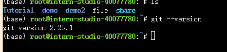
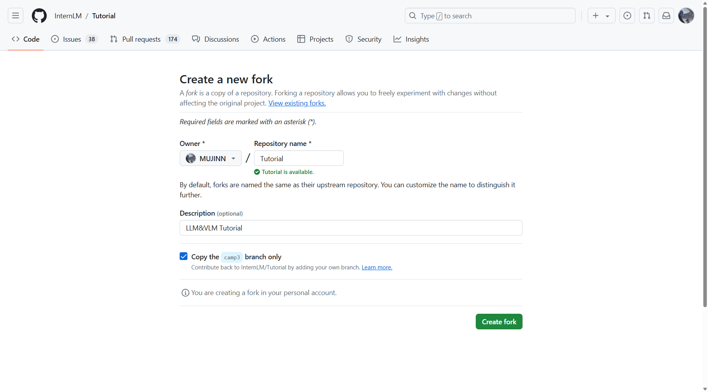
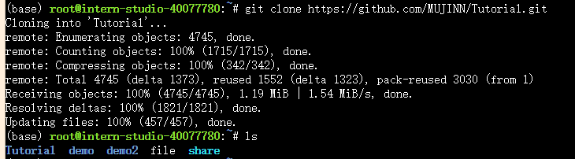
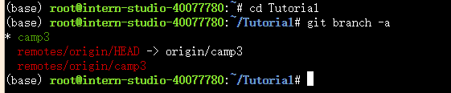
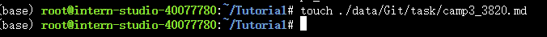
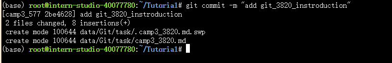
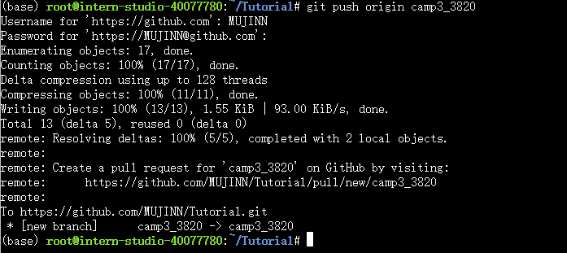
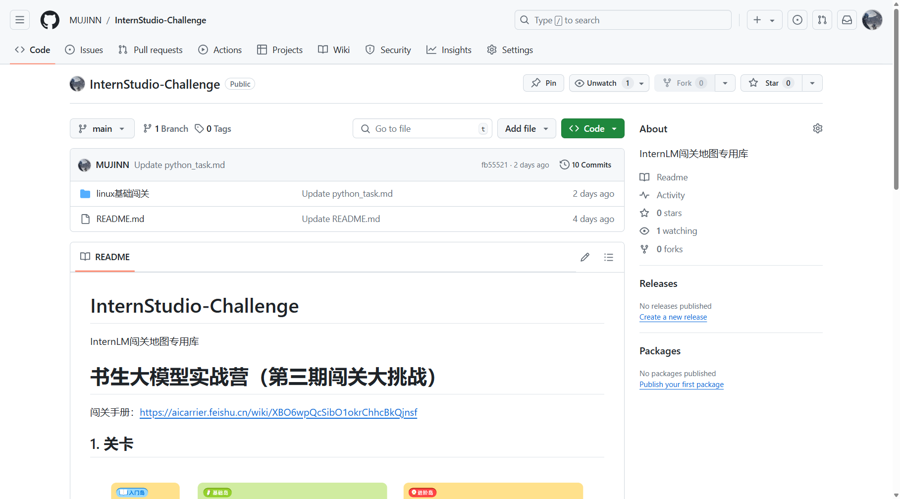

## Git任务概览


- **任务1**: 破冰活动：自我介绍
  - 每位参与者提交一份自我介绍。 提交地址：https://github.com/InternLM/Tutorial 的 camp3 分支～
  - 要求
    - 命名格式为 `camp3_<id>.md`，其中 `<id>` 是您的报名问卷ID。
    - 文件路径应为 `./data/Git/task/`。
    - 【大家可以叫我】内容可以是 GitHub 昵称、微信昵称或其他网名。
    - 在 GitHub 上创建一个 Pull Request，提供对应的 PR 链接。
- **任务2**: 实践项目：构建个人项目

### Git简介

**Git 是一种开源的分布式版本控制系统，广泛应用于软件开发领域，尤其是在协同工作环境中。**

官网：https://git-scm.com/

官方文档：[Git - Book](https://git-scm.com/book/en/v2)

Git 基础：[Git 基础知识](https://aicarrier.feishu.cn/wiki/YAXRwLZxPi8Hy6k3tOQcuwAHn5g)

#### **工作区、暂存区和 Git 仓库区**

- 工作区（Working Directory）： 当我们在本地创建一个 Git 项目，或者从 GitHub 上 clone 代码到本地后，项目所在的这个目录就是“工作区”。这里是我们对项目文件进行编辑和使用的地方。
- 暂存区（Staging Area）： 暂存区是 Git 中独有的一个概念，位于 .git 目录中的一个索引文件，记录了下一次提交时将要存入仓库区的文件列表信息。使用 git add 指令可以将工作区的改动放入暂存区。
- 仓库区 / 本地仓库（Repository）： 在项目目录中，.git 隐藏目录不属于工作区，而是 Git 的版本仓库。这个仓库区包含了所有历史版本的完整信息，是 Git 项目的“本体”。

**文件状态** 文件在 Git 工作区中的状态可以是：

- 已跟踪：文件已被纳入版本控制，根据其是否被修改，可以进一步分为未修改（Unmodified）、已修改（Modified）或已暂存（Staged）。
- 未跟踪：文件存在于工作目录中，但还没被纳入版本控制，也未处于暂存状态。

**分支** 分支是 Git 的一大特性，支持轻量级的分支创建和切换。Git 鼓励频繁使用分支和合并，使得并行开发和错误修正更为高效。

#### **主要功能**

- **代码历史记录跟踪**

  Git 记录每一次代码提交，允许用户查看项目的历史版本和变更记录，从而理解每个阶段的开发细节。

- **团队协作**

  支持多人同时对同一项目工作，提供了合并、分支和版本控制的功能，以确保多人协作的效率和代码的整合性。

- **变更审查**

  允许开发者查看代码变更的具体内容，了解谁在何时做了哪些修改，这对于代码审查和质量控制至关重要。

- **实现机制**

| 特性       | 描述                                                         |
| ---------- | ------------------------------------------------------------ |
| 分布式架构 | 与集中式版本控制系统不同，Git 在每个开发者的机器上都存有完整的代码库副本，包括完整的历史记录。这种分布式的特性增强了数据的安全性和获取效率。 |
| 分支管理   | Git 的分支管理功能非常灵活，支持无缝切换到不同的开发线路（分支），并允许独立开发、测试新功能，最终通过合并操作将这些功能稳定地集成到主项目中。 |
| 快照系统   | Git 通过快照而非差异比较来管理数据。每次提交更新时，Git 实际上是在存储一个项目所有文件的快照。如果文件没有变化，Git 只是简单地链接到之前存储的文件快照。 |

#### **常用的 Git 操作**

| 命令                                | 命令描述                                                     |
| :---------------------------------- | :----------------------------------------------------------- |
| **git init**                        | 初始化一个新的 Git 仓库，在当前目录创建一个 .git 隐藏文件夹来跟踪项目的版本历史。 |
| **git clone <repository-url>**      | 从指定的 URL 克隆一个远程仓库到本地。                        |
| **git add <file>** 或 **git add .** | 将指定的文件或当前目录下的所有修改添加到暂存区，准备提交。   |
| **git commit -m "message"**         | 提交暂存区的修改，并附带一个有意义的提交消息来描述更改的内容。 |
| **git status**                      | 查看工作目录和暂存区的状态，包括哪些文件被修改、添加或删除。 |
| **git log**                         | 查看提交历史，包括提交的作者、日期和提交消息。               |
| **git branch**                      | 列出所有本地分支。                                           |
| **git branch <branch-name>**        | 创建一个新的分支。                                           |
| **git checkout <branch-name>**      | 切换到指定的分支。                                           |
| **git merge <branch-name>**         | 将指定的分支合并到当前分支。                                 |
| **git push**                        | 将本地的提交推送到远程仓库。                                 |
| **git pull**                        | 从远程仓库拉取最新的更改并合并到本地分支。                   |
| **git stash**                       | 暂存当前未提交的修改，以便在需要时恢复。                     |
| **git stash pop**                   | 恢复最近暂存的修改。                                         |


### 任务1: 破冰活动：自我介绍


**1.安装Git**




**2.fork Tutorial项目**

```shell
git clone https://github.com/MrCatAI/Tutorial.git # 修改为自己frok的仓库
cd Tutorial/ #进入本地仓库
git branch -a #列出本地仓库所有分支
git checkout -b camp3 origin/camp3 #切换到camp3分支
touch ./data/Git/task/camp3_3820.md # 创建自己的md文件
```

clone 项目到本地



查看并切换到camp3



创建md文件

提交（注意创建提交令牌）





## 任务2: 实践项目：构建个人项目


### 目标


创建一个个人仓库，用于提交笔记、心得体会或分享项目。


1. 创建并维护一个公开的大模型相关项目或笔记仓库。
2. 提交作业时，提供您的 GitHub 仓库链接。[MUJINN/Tutorial: LLM&VLM Tutorial (github.com)](https://github.com/MUJINN/Tutorial)
3. 如果您不常使用 GitHub，您可以选择其他代码管理平台，如 Gitee，并提交相应的链接。
4. 仓库介绍中添加超链接跳转[MUJINN/Tutorial: LLM&VLM Tutorial (github.com)](https://github.com/MUJINN/Tutorial)


