 闯关任务需要在关键步骤中截图：

|            | 任务描述                                      | 完成所需时间 |
| ---------- | --------------------------------------------- | ------------ |
| 闯关任务   | 完成SSH连接与端口映射并运行`hello_world.py`   | 10min        |
| 可选任务 1 | 将Linux基础命令在开发机上完成一遍             | 10min        |
| 可选任务 2 | 使用 VSCODE 远程连接开发机并创建一个conda环境 | 10min        |
| 可选任务 3 | 创建并运行`test.sh`文件                       | 10min        |

### 1.什么是SSH？

全称Secure Shell，可直译为安全外壳协议，是一种专为远程登录会话和其他网络服务提供安全性的协议。有效防止远程管理过程中的信息泄露问题。

SSH由IETF（The Internet Engineering Task Force（国际互联网工程任务组），公开性质的大型民间国际团体）的网络小组（Network Working Group）所制定，建立在应用层基础上的安全协议。

SSH是（C/S架构）由客户端和服务端的软件组成，工作机制大致为本地客户端发送一个连接请求到远程服务端，服务端检查申请的包和ip地址再发送密钥给SSH的客户端，本地再将密钥发回服务端

### 2.SSH远程连接开发机（InternStudio闯关任务）

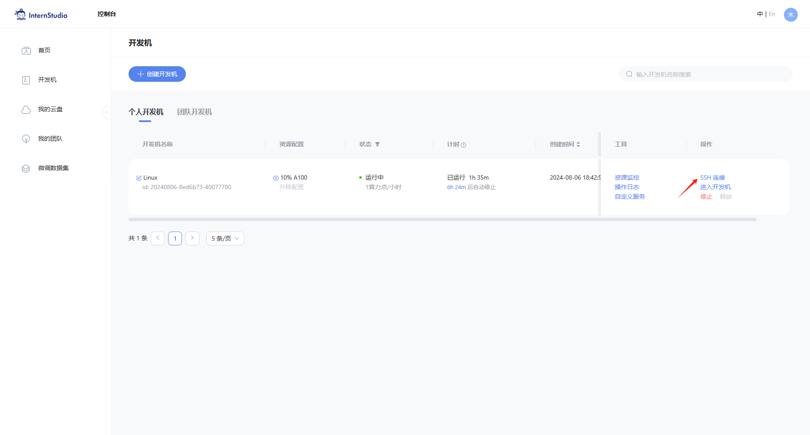

#### 2.1使用密码进行SSH远程连接

```shell
ssh -p 43756 root@ssh.intern-ai.org.cn -o StrictHostKeyChecking=no -o UserKnownHostsFile=/dev/null
```

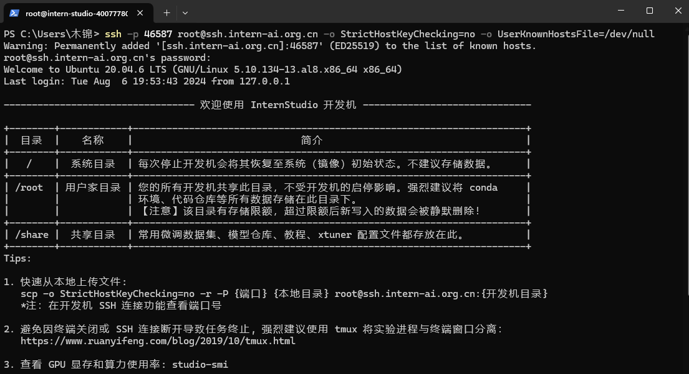

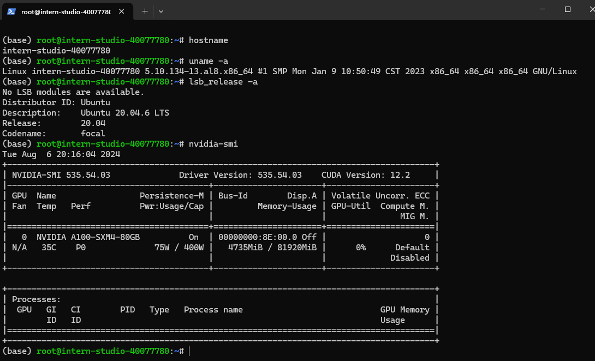

#### 2.2免密登录

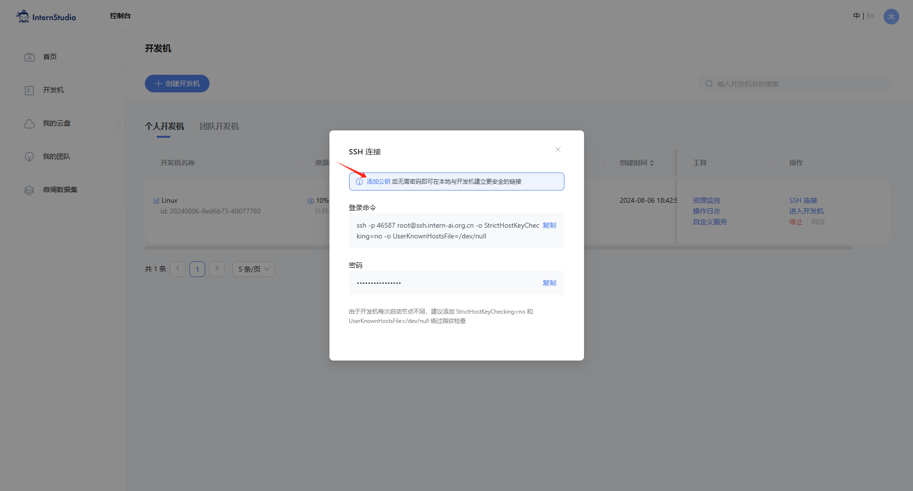

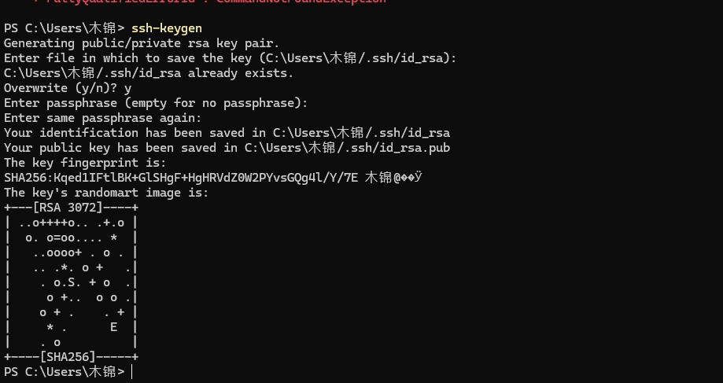


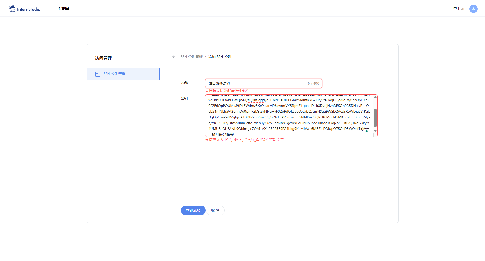

由于计算机用户名是中文，生成密钥有中文字符，InternStudio无法识别，老实输密码登录。

### 3.端口映射

#### 3.1什么是端口映射？

##### 3.1.1什么是端口呢？

在计算机网络中，端口（Port）是指计算机或网络设备上用于识别特定进程或服务的逻辑终端。端口号是一个 16 位的整数，取值范围从 0 到 65535。每个端口号对应于计算机上运行的某个特定服务或应用程序。端口的主要作用是帮助传输层（如 TCP 或 UDP）区分不同的网络服务和应用程序。

##### 3.1.2 什么是映射呢？

在端口映射（Port Mapping）中，映射是指将外部网络的一个端口号关联到内部网络中某台设备的一个端口号。这样，外部网络的设备通过访问路由器的某个端口，可以实际访问到内部网络中对应设备的服务。

##### 3.1.3端口映射

一种网络技术，可以将一个网络设备（通常是路由器）的端口映射到另一个网络设备（通常是内部网络中的计算机或服务器）的端口，这样，外部网络的设备可以通过访问路由器的某个端口访问内部网络中某台计算机或服务器。

端口映射常见于NAT（网络地址转换）和防火墙配置中，主要有以下两种类型：

1. **静态端口映射（Static Port Mapping）**：将一个特定的外部端口永久性地映射到内部网络中的一个特定IP地址和端口。例如，将外部的端口80映射到内部服务器的IP地址192.168.1.2的端口80，用于托管Web服务。
2. **动态端口映射（Dynamic Port Mapping）**：通常由UPnP（通用即插即用）或其他自动化机制来动态配置端口映射。这样，内部设备可以请求路由器为其分配外部端口，并动态创建映射。

利用端口映射可以绕过代理服务器，直接访问内部服务，避免可能出现的代理问题。

#### 3.2如何进行端口映射？

##### 3.2.1使用ssh命令

```shell
ssh -p 46587 root@ssh.intern-ai.org.cn -CNg -L {本地机器_PORT}:127.0.0.1:{开发机_PORT} -o StrictHostKeyChecking=no
```

**具体步骤（闯关任务)**

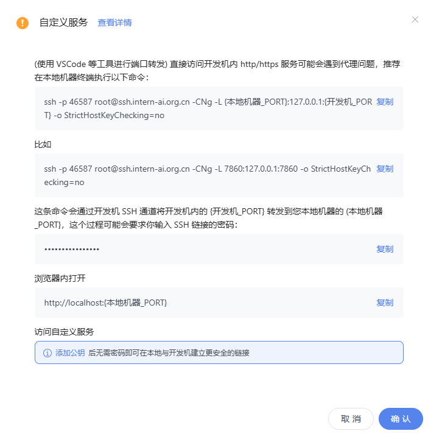

映射端口：7860

```shell
ssh -p 46587 root@ssh.intern-ai.org.cn -CNg -L 7860:127.0.0.1:7860 -o StrictHostKeyChecking=no
```


创建hello_world.py

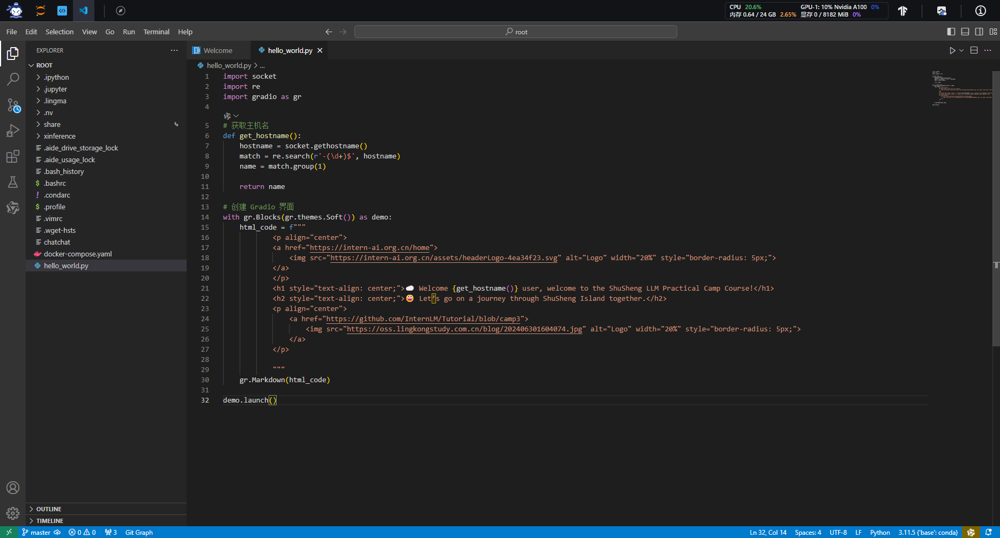

安装gradio

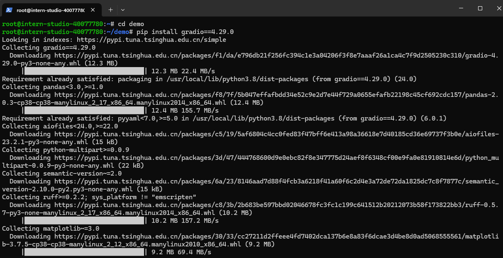

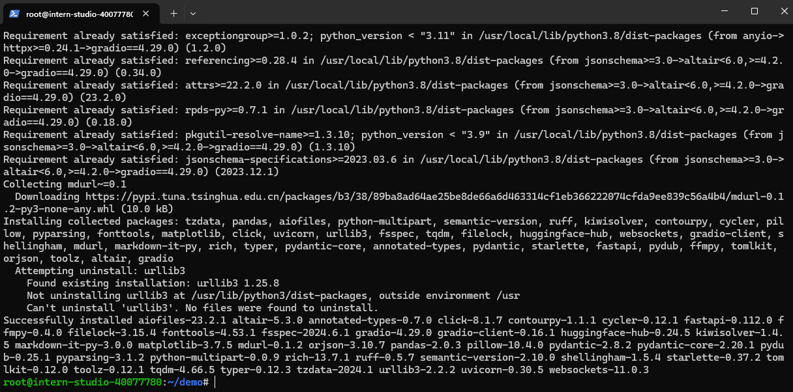

运行hello_world.py

运行成功


### 4.linux基础命令（可选任务1）

#### 4.1文件管理

在 Linux 中，常见的文件管理操作包括：

- 创建文件：可以使用 **touch** 命令创建空文件。

- 创建目录：使用 **mkdir** 命令。

- 目录切换：使用 **cd** 命令。

- 显示所在目录：使用 **pwd** 命令。

- 查看文件内容：如使用 **cat** 直接显示文件全部内容，**more** 和 **less** 可以分页查看。

- 编辑文件：如 **vi** 或 **vim** 等编辑器。

- 复制文件：用 **cp** 命令。

- 创建文件链接：用 **ln** 命令。

- 移动文件：通过 **mv** 命令。

- 删除文件：使用 **rm** 命令。

- 删除目录：**rmdir**（只能删除空目录）或 **rm -r**（可删除非空目录）。

- 查找文件：可以用 **find** 命令。

- 查看文件或目录的详细信息：使用 **ls** 命令，如使用 **ls -l** 查看目录下文件的详细信息。

- 处理文件：进行复杂的文件操作，可以使用 **sed** 命令。

  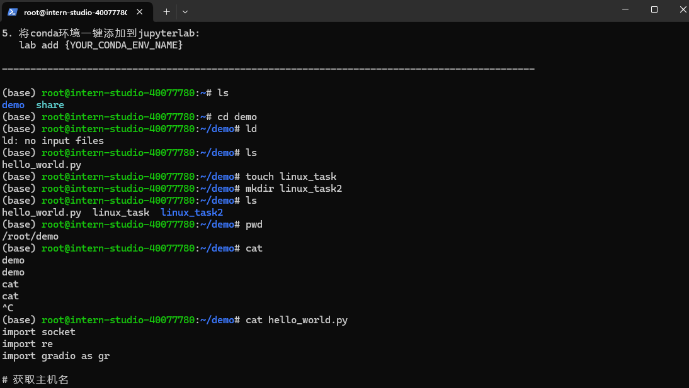

  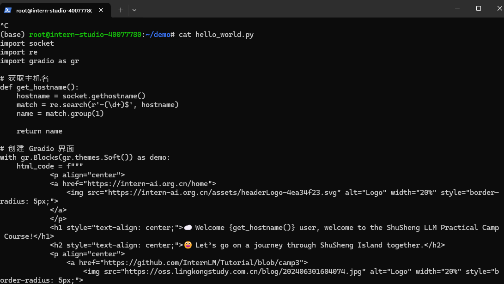

  vim/vi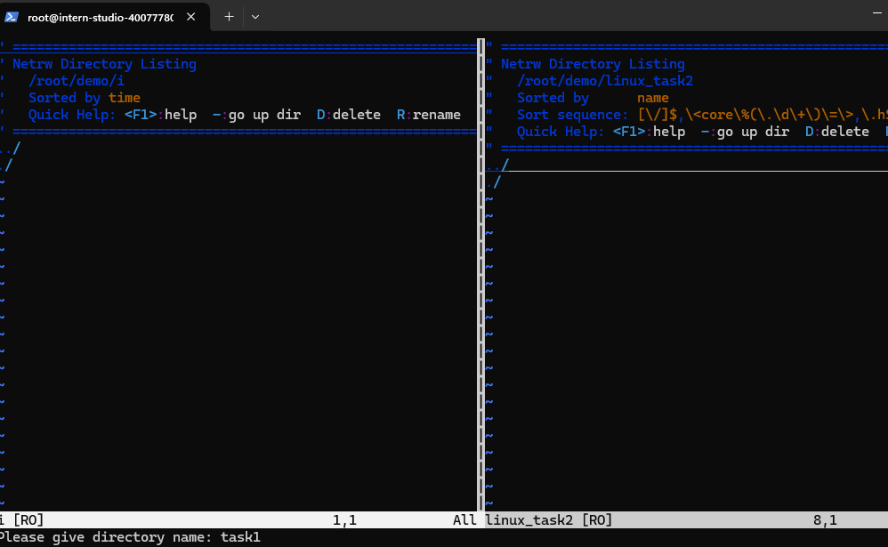

  增加删除更改等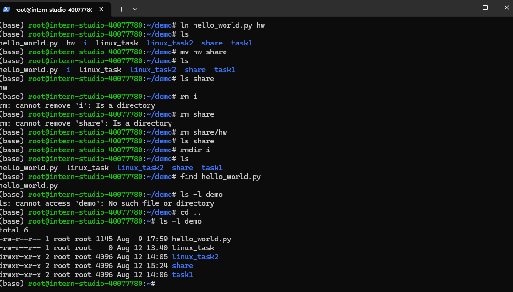

  

  echo，sed

  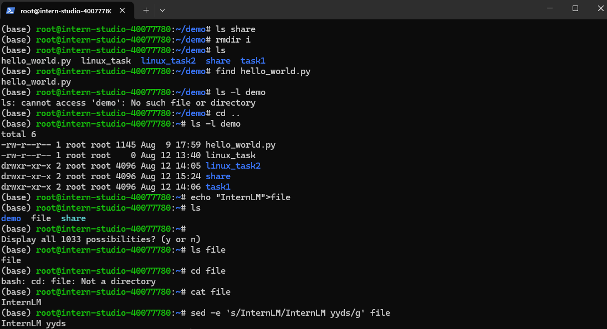

#### 4.2进程管理

进程管理命令是进行系统监控和进程管理时的重要工具，常用的进程管理命令有以下几种：

- ps：查看正在运行的进程
- top：动态显示正在运行的进程
- pstree：树状查看正在运行的进程
- pgrep：用于查找进程
- nice：更改进程的优先级
- jobs：显示进程的相关信息
- bg 和 fg：将进程调入后台
- kill：杀死进程
- nvidia-smi：NVIDIA 系统管理接口

#### 4.3工具使用

TMUX 是一个终端多路复用器。它可以在多个终端之间轻松切换，分离它们（这不会杀死终端，它们继续在后台运行）和将它们重新连接到其他终端中。

#### 4.4权限管理（待补充）

### 5.使用 VSCODE 远程连接开发机并创建一个conda环境(可选任务2)

#### 5.1 VScode远程连接开发机

VScode下载插件

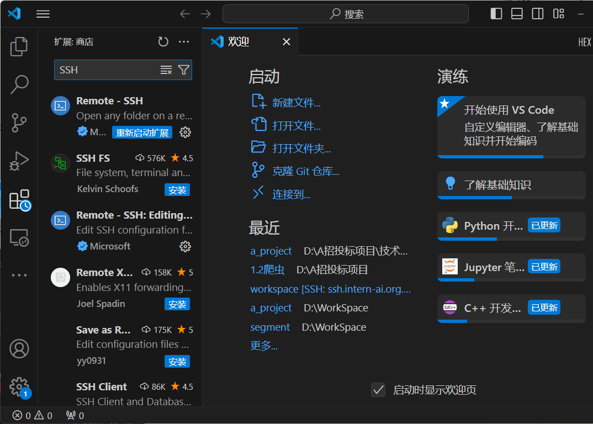

配置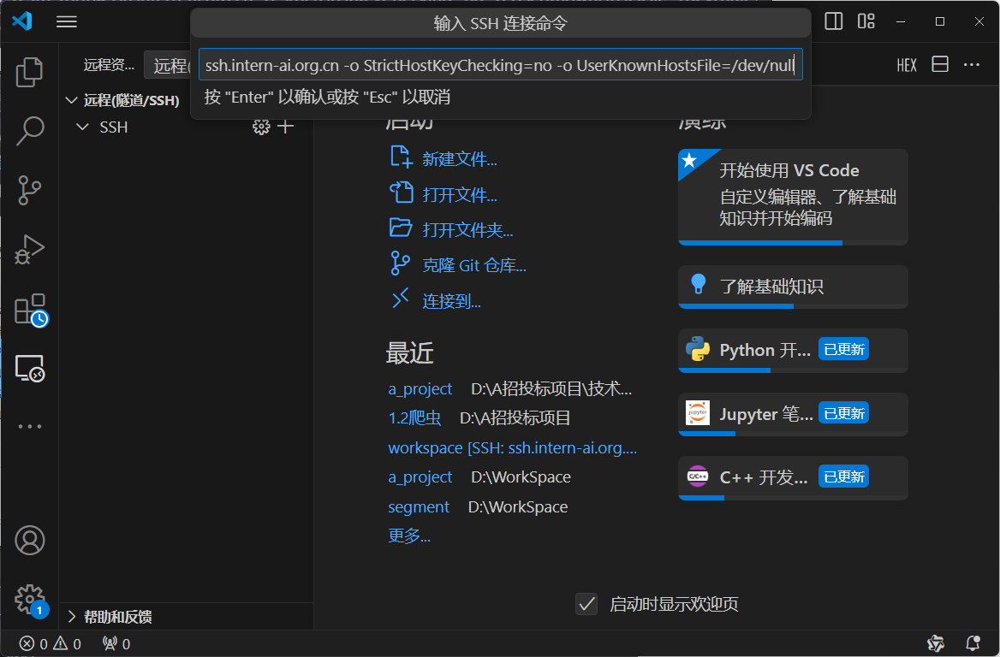

进入连接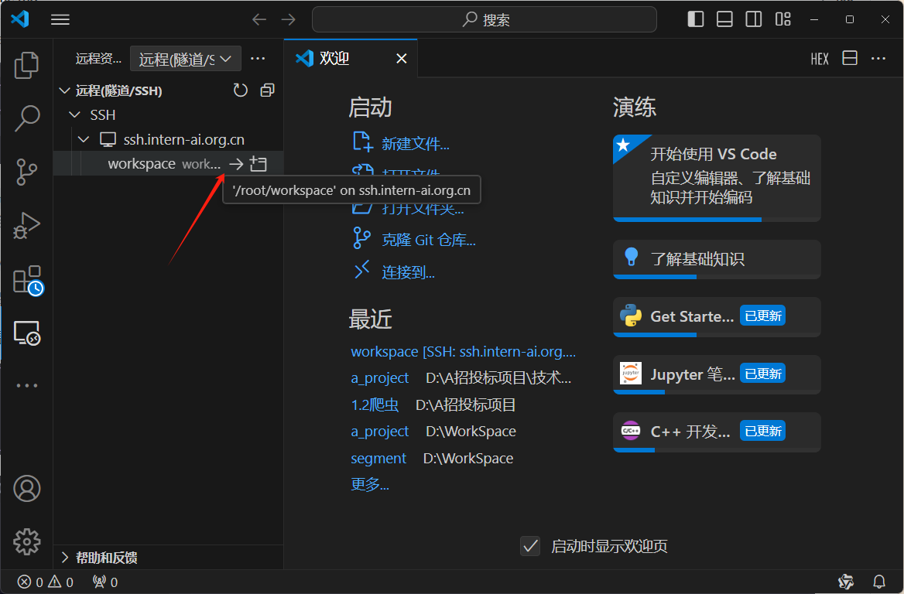

输入密码后连接成功，打开工作区开始食用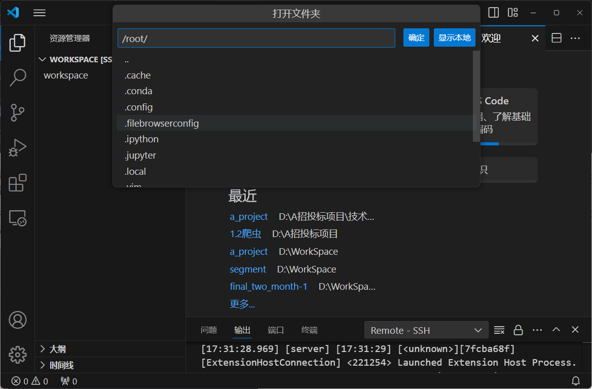

#### 5.2 创建conda环境（自选任务2）

创建一个名为task的环境

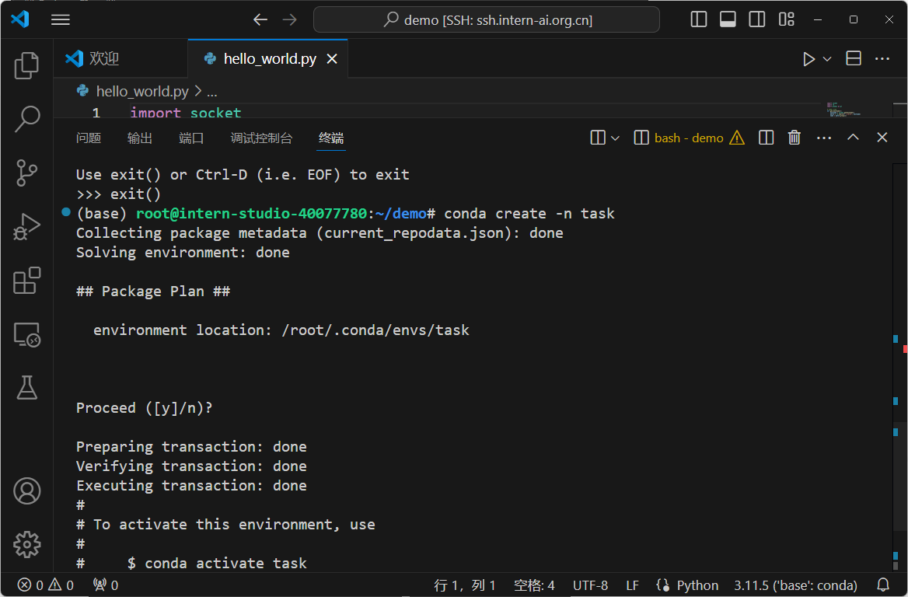

激活环境task成功


### 6.创建并运行`test.sh`文件（可选任务3）

#### 6.1 创建test.sh

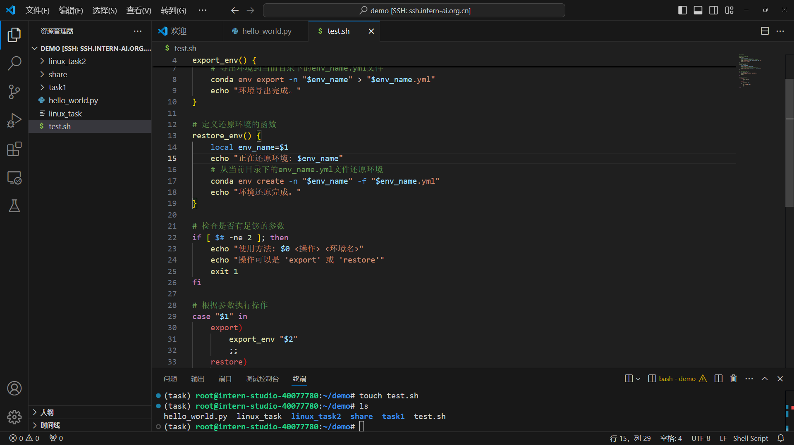

#### 6.2运行test.sh

先导出task环境到task.yml文件

再删除task环境，最后运行test.sh恢复

