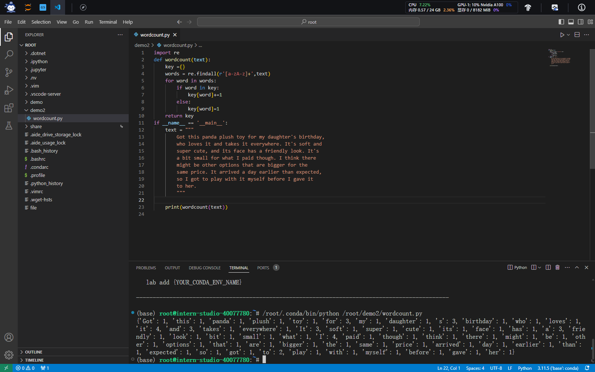
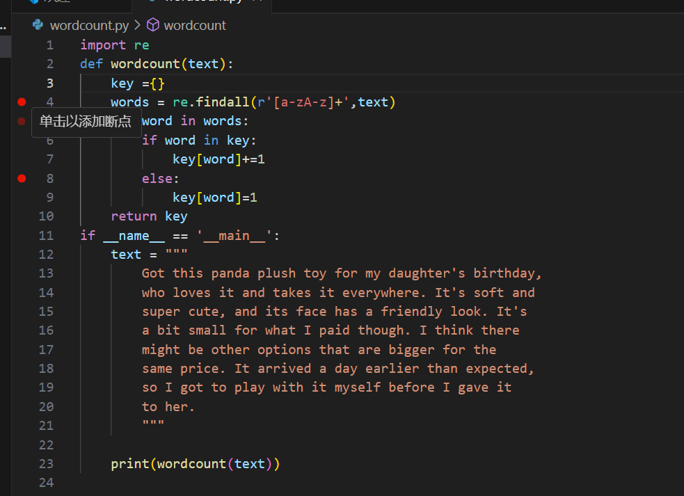
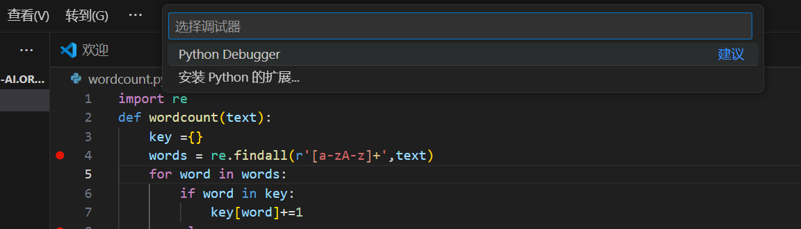
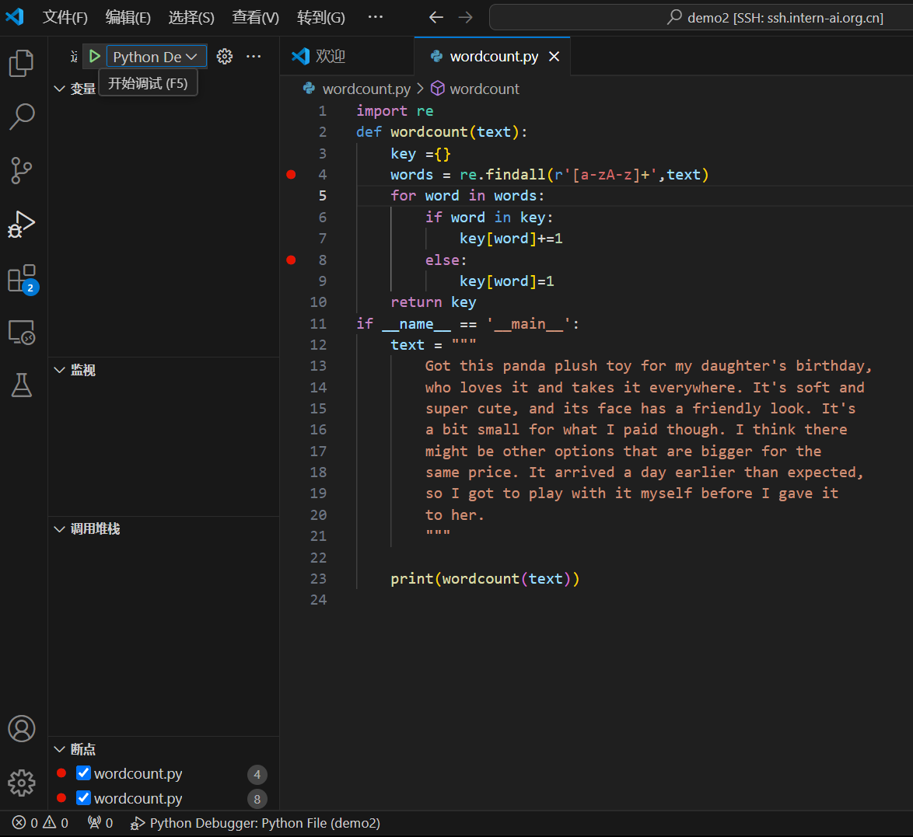
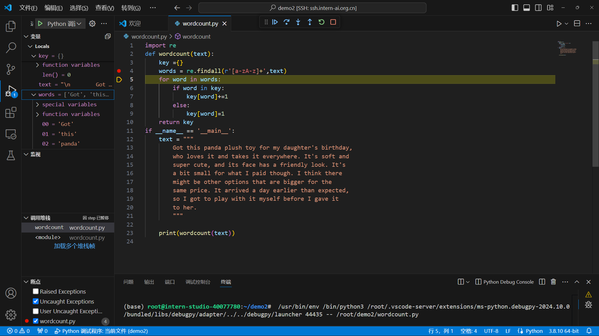
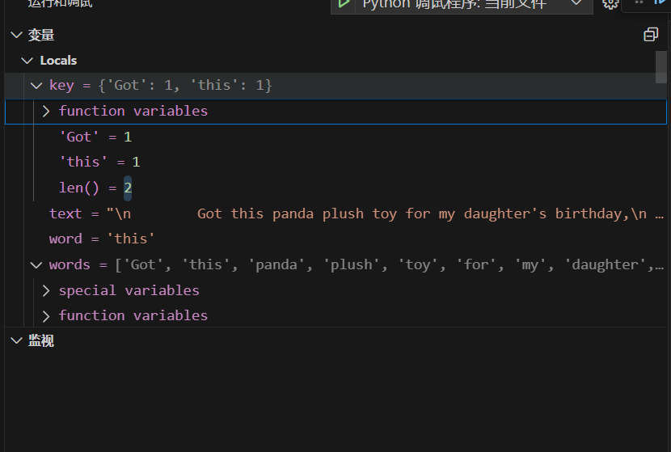
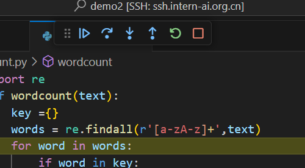

# Python task


### 任务概览

| 任务类型 | 任务内容                         | 预计耗时 |
| -------- | -------------------------------- | -------- |
| 闯关任务 | Python实现wordcount              | 15mins   |
| 闯关任务 | Vscode连接InternStudio debug笔记 | 15mins   |

 提交地址：https://aicarrier.feishu.cn/share/base/form/shrcnZ4bQ4YmhEtMtnKxZUcf1vd

### 任务一

请实现一个wordcount函数，统计英文字符串中每个单词出现的次数。返回一个字典，key为单词，value为对应单词出现的次数。Eg:

Input:

```
"""Hello world!  
This is an example.  
Word count is fun.  
Is it fun to count words?  
Yes, it is fun!"""
```

Output:

```
{'hello': 1, 'world': 1, 'this': 1, 'is': 4, 'an': 1, 'example': 1, 'word': 1, 'count': 2,
'fun': 3, 'it': 2, 'to': 1, 'words': 1, 'yes': 1}
```

TIPS：记得先去掉标点符号,然后把每个单词转换成小写。不需要考虑特别多的标点符号，只需要考虑实例输入中存在的就可以。

```
text = """
Got this panda plush toy for my daughter's birthday,
who loves it and takes it everywhere. It's soft and
super cute, and its face has a friendly look. It's
a bit small for what I paid though. I think there
might be other options that are bigger for the
same price. It arrived a day earlier than expected,
so I got to play with it myself before I gave it
to her.
"""

def wordcount(text):
    pass
```



### 任务二

请使用本地vscode连接远程开发机，将上面你写的wordcount函数在开发机上进行debug，体验debug的全流程，并完成一份debug笔记(需要截图)。

连接到开发机


设断点



启用调试


Debug



点击开始运行



当代码在断点处停下来时，你可以查看和修改变量的值。在“Run and Debug”侧边栏的“Variables”（变量）部分，你可以看到当前作用域内的所有变量及其值。



可以逐过程或者单步调试，能看到程序中的字典key逐渐变化



debug面板各按钮功能介绍：继续，逐过程，单步调试，单步跳出，重启，



1. `continue`: 继续运行到下一个断点
2. `step over`：跳过，可以理解为运行当前行代码，不进入具体的函数或者方法
3. `step into`: 进入函数或者方法。如果当行代码存在函数或者方法时，进入代码该函数或者方法。如果当行代码没有函数或者方法，则等价于step over
4. `step out`：退出函数或者方法, 返回上一层
5. `restart`：重新启动debug